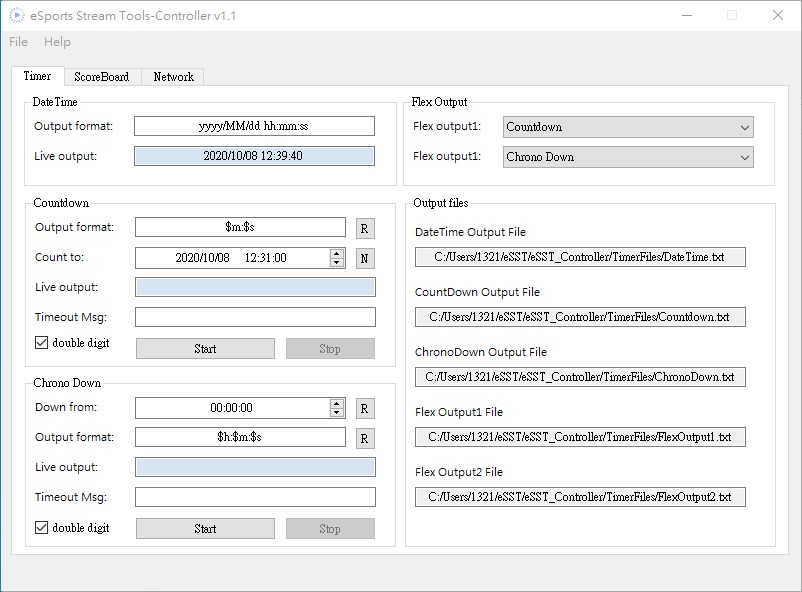
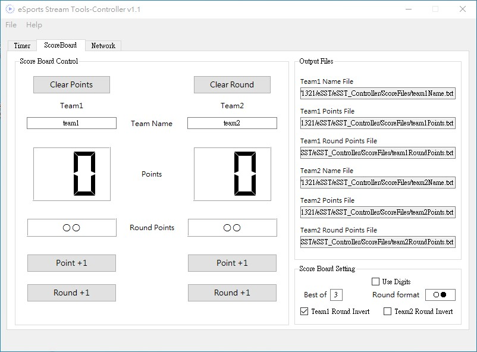

# eSports-Stream-Tools
For eSports Streaming with timer, score board and more

## Get started

 - you can download eSports-Stream-Tools from [release page](https://github.com/RuiChen0101/eSports-Stream-Tools/releases)

## Overview
 - ### Timer
  

   Module | Short description
  ------------ | -------------
  DateTime | system date and time
  Countdown | countdown to specified time *(Live countdown. Ex. Stream live in: 0h 30m 12s)*
  Chrono Down | countdown from value
  Flex output | can change source from three module above

  **Timer format**

  Token | Usage
  ------------ | -------------
  $s | second
  $m | minute
  $h | hour
  $d | day

 - ### Scoreboard
  

  Function | Short description
  ------------ | -------------
  Clear Score | reset both team's points
  Clear Round | reset both team's round points
  Point+1, Round+1 | add point or round point
  Best of N | set max round in Best of N format (max round = (N+1)/2)
  Use digit | display round points in digit mod
  Round format | first char represent as padding point and second as obtained point
  Round Invert | reverse output of round point

## Reference
Icons made by [Smashicons](https://smashicons.com/) from [www.flaticon.com](https://www.flaticon.com/)
