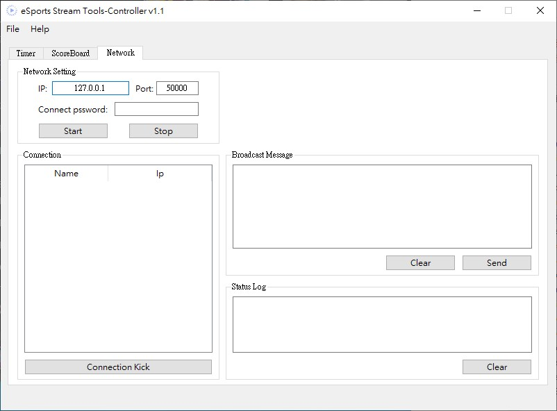
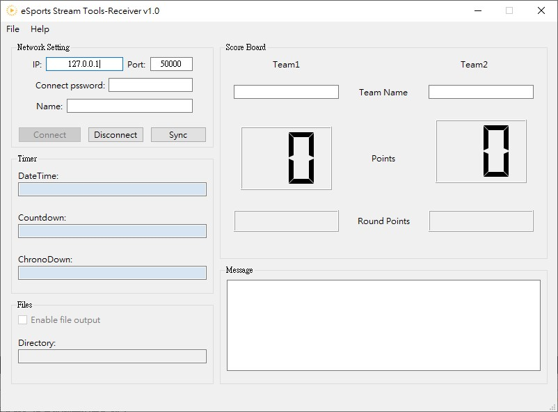

# eSports-Stream-Tools
For eSports Streaming with timer, score board and more

Branch | Build status
------------ | -------------
Master | 
Develop | 

## Get started

 - you can download the latest version from [release page](https://github.com/RuiChen0101/eSports-Stream-Tools/releases)

## Overview
 - ### Controller

Main interface to controll **timer**, **scoreboard** and **network connection**. Timer and score board will output content to the file for integration with **OBS**. Moreover, with Receiver connected, match info will synchronize automatically to all receiver so player can have better awareness over current match status.

for more information, visit [Controller manual](eSST_Controller_Gui/README.md)

   Timer | Scoreboard | Network
  ------------ | ------------- | -------------
   |  | 

  - ### Receiver

Receive and display current match status controled by Controller.

for more information, visit [Receiver manual](eSST_Receiver_Gui/README.md)

|  Info |
| ------------ |
|  |

## Reference
 - Idea inspire by [snaz](https://github.com/JimmyAppelt/Snaz)
 - Icons made by [Smashicons](https://smashicons.com/) from [www.flaticon.com](https://www.flaticon.com/)
