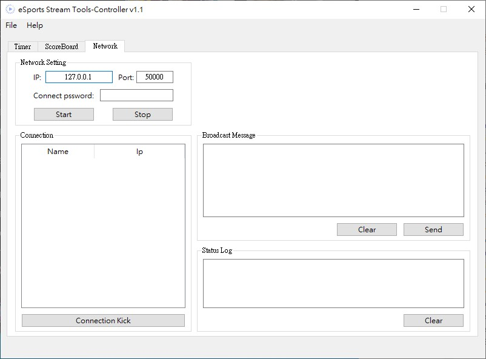

# eSports Stream Tools Controller

Main interface to controll **timer**, **score board** and **network connection**. Timer and score board will output content to the file for integration with **OBS**. Moreover, with Receiver connected, match info will synchronize automatically to all receiver so player can have better awareness over current match status.

## Overview
 - ### Timer
  

   Module | Short description
  ------------ | -------------
  DateTime | system date and time
  Countdown | countdown to specified time *(Live countdown. Ex. Stream live in: 0h 30m 12s)*
  Chrono Down | countdown from value
  Flex output | can change source from three module above

  **Timer format**

  Token | Usage
  ------------ | -------------
  $s | second
  $m | minute
  $h | hour
  $d | day

 - ### Scoreboard
  

  Function | Short description
  ------------ | -------------
  Clear Score | reset both team's points
  Clear Round | reset both team's round points
  Point+1, Round+1 | add point or round point
  Best of N | set max round in Best of N format (max round = (N+1)/2)
  Use digit | display round points in digit mod
  Round format | first char represent as pending point and second as obtained point
  Round Invert | reverse output of round point

- ### Network
 

 Group | Short description
 ------------ | -------------
 Network setting | set ip of your computer, port you want to listen and password then click "Start".
 Connection | list all connection here with name and ip, you can use "Connection kick" to disconnect receiver.
 Broadcast Message | Message here will sync to all receiver after click "Send".
 Status log | viewing server status log.
