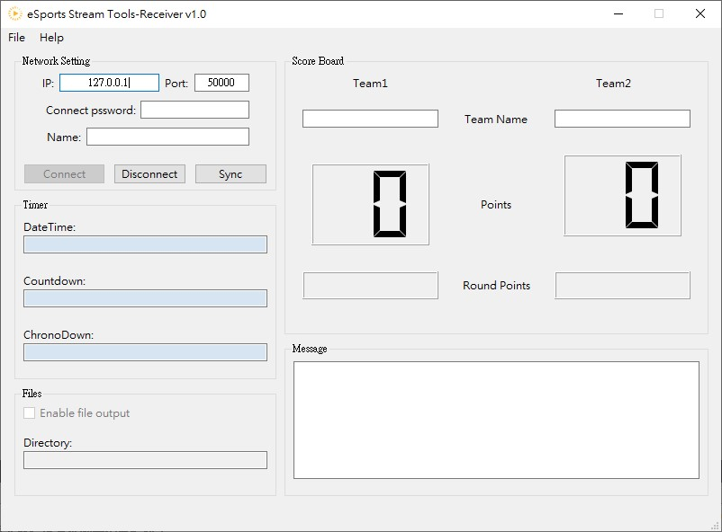

# eSports Stream Tools Receiver

Receive and display current match status controled by Controller.

## Overview
  

 Group | Short description
 ------------ | -------------
 Network setting | set ip, port and password to match Controller's setting and set yout name then click "Connect". Use "Sync" to forcing sync with Controller.
 Timer | timer info
 Scoreboard | score board info
 Message | Message send by controller.
 Files | output file as controller do.
